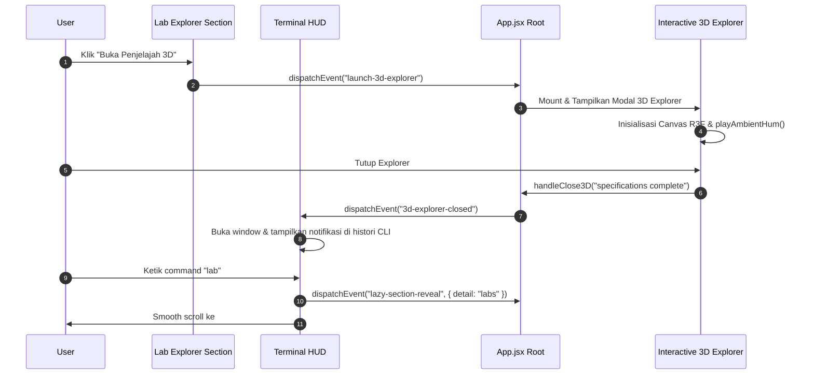

# Dokumentasi Teknikal: Interactive 3D Computer Explorer & Terminal HUD

Dokumen ini berisi panduan teknikal mendalam mengenai dua fitur interaktif utama yang baru ditambahkan pada Portal Web UPT Komputer IWIMA:
1. **Interactive 3D Computer Explorer** (`src/components/3d/Interactive3DExplorer.jsx` & `src/components/3d/ComputerModels.jsx`)
2. **Terminal HUD & System Status Monitor** (`src/components/common/TerminalHUD.jsx`)
3. **Web Audio API SFX Synthesizer** (`src/utils/audioSFX.js`)
4. **Global Event Bus Communication**

---

## 1. Interactive 3D Computer Explorer

### 1.1 Deskripsi Feature
Interactive 3D Computer Explorer memberikan pengalaman interaktif 3D visual kepada pengguna untuk mempelajari dan mengeksplorasi arsitektur komponen hardware motherboard komputer laboratorium secara realistis.

Pengguna dapat memutar, memperbesar (*zoom*), menggeser kamera, serta mengklik hotspot komponen tertentu (CPU, RAM, GPU, SSD, PSU, dan Air Cooler) untuk melihat spesifikasi teknis mendalam dan mendengarkan efek suara sintetis (*audio SFX*).

### 1.2 Berkas Terkait
- [src/components/3d/Interactive3DExplorer.jsx](file:///c:/Users/Ardiansyah/Documents/upt_komputer_iwima/src/components/3d/Interactive3DExplorer.jsx) — Modal overlay utama, kontrol kamera, pengelolaan state audio, dan drawer spesifikasi komponen.
- [src/components/3d/ComputerModels.jsx](file:///c:/Users/Ardiansyah/Documents/upt_komputer_iwima/src/components/3d/ComputerModels.jsx) — Pemodelan objek 3D prosedural menggunakan komponen React Three Fiber & Drei (Motherboard PCB, CPU socket, RAM slots, PCIe GPU card, NVMe SSD, Modular PSU, dan Tower CPU Air Cooler).

### 1.3 Komponen Hardware & Spesifikasi yang Dideskripsikan
| ID Komponen | Nama Komponen | Highlight Spesifikasi |
| :--- | :--- | :--- |
| `cpu` | Central Processing Unit | Intel Core i7-13700 (16 Cores / 24 Threads, 5.40 GHz Turbo, 30MB Cache) |
| `ram` | High-Speed DDR4 Memory | 16GB (2x8GB Kit) DDR4 Dual-Channel 3200 MHz CL16 |
| `gpu` | Graphics Processing Unit | NVIDIA GeForce GTX 1060 6GB GDDR5 Dedicated (1280 CUDA Cores) |
| `ssd` | NVMe High-Speed SSD | 512GB M.2 NVMe PCIe Gen3 x4 (Read 3,500 MB/s, Write 3,000 MB/s) |
| `psu` | Power Supply Unit | 750W 80 PLUS Gold Certified Full Modular |
| `cooler` | Tower Air CPU Cooler | Single Tower Heatsink, 4 Direct-Contact Copper Heatpipes, 120mm PWM Silent Fan |

### 1.4 Teknologi & Dependencies
- `@react-three/fiber`: React renderer untuk Three.js
- `@react-three/drei`: Library helper untuk Three.js/R3F (OrbitControls, PerspectiveCamera, Stars, Float)
- `three`: 3D Graphics Engine

---

## 2. Terminal HUD & System Status Monitor

### 2.1 Deskripsi Feature
Terminal HUD adalah widget melayang (*floating widget*) bertema retro-futuristis yang terletak di pojok kanan bawah halaman. Widget ini menyediakan antarmuka Command Line Interface (CLI) interaktif serta pemantauan metrik server UPT secara real-time.

### 2.2 Berkas Terkait
- [src/components/common/TerminalHUD.jsx](file:///c:/Users/Ardiansyah/Documents/upt_komputer_iwima/src/components/common/TerminalHUD.jsx)

### 2.3 Daftar Perintah CLI Interaktif
Pengguna dapat mengetikkan perintah berikut pada terminal:
- `help` : Menampilkan daftar perintah interaktif yang tersedia.
- `status` : Menampilkan statistik real-time server & jaringan UPT (Ping, CPU Load, Memory Usage, Active Workstations, Bandwidth).
- `lab` : Memicu smooth scroll ke bagian Penjelajah Laboratorium (`#labs`) dan mengaktifkan render seksi laboratorium.
- `specs` : Menampilkan ringkasan spesifikasi workstation utama laboratorium.
- `ticket` : Memicu smooth scroll ke bagian Formulir Bantuan Teknis (`#support`).
- `clear` : Membersihkan histori layar terminal.

### 2.4 Live System Metric Simulation
Terminal HUD mensimulasikan fluktuasi metrik server secara real-time dengan *interval update* setiap 3 detik:
- **CPU Load**: 12% – 85%
- **RAM Usage**: 35% – 90%
- **Ping / Latency**: 2ms – 12ms
- **Active Workstations**: 28 / 35 PC (80% Kapasitas)

---

## 3. Web Audio API SFX Synthesizer

### 3.1 Deskripsi Feature
Untuk memberikan efek imersif tanpa membebatan ukuran aset jaringan (*zero external MP3/WAV audio assets*), aplikasi menggunakan Web Audio API murni untuk memproses dan mensintesis efek suara langsung melalui browser (*procedural sound generation*).

### 3.2 Berkas Terkait
- [src/utils/audioSFX.js](file:///c:/Users/Ardiansyah/Documents/upt_komputer_iwima/src/utils/audioSFX.js)

### 3.3 Fungsi Suara yang Disediakan
1. `playAmbientHum()`: Mensintesis suara derum rendah fan/server (Low A 55Hz Sawtooth wave dengan Lowpass Filter 180Hz) yang dapat diputar secara kontinu selama 3D Explorer aktif.
2. `playComponentChime()`: Efek suara *futuristic chime* (Sine wave 880Hz → 1760Hz ramp) saat pengguna mengklik komponen hardware.
3. `playElectricZap()`: Efek suara *zap listrik* (Triangle wave 2400Hz → 400Hz ramp) saat memilih atau menutup komponen.

---

## 4. Arsitektur Komunikasi Custom Event Bus

Seluruh fitur interaktif dihubungkan melalui Custom Event listener global pada objek `window`:

### Event Identifiers
- `launch-3d-explorer`: Dipicu dari [LabExplorer.jsx](file:///c:/Users/Ardiansyah/Documents/upt_komputer_iwima/src/components/sections/LabExplorer.jsx) atau `TerminalHUD.jsx` untuk membuka modal 3D Explorer di [App.jsx](file:///c:/Users/Ardiansyah/Documents/upt_komputer_iwima/src/App.jsx).
- `3d-explorer-closed`: Dipicu saat modal 3D Explorer ditutup, mengirimkan detail notifikasi ke [TerminalHUD.jsx](file:///c:/Users/Ardiansyah/Documents/upt_komputer_iwima/src/components/common/TerminalHUD.jsx).
- `lazy-section-reveal`: Dipicu saat navigasi terminal memerlukan pemuatan seksi lazy-loaded (`#labs`, `#support`, dll.).

---

*Dokumentasi disiapkan untuk UPT Komputer IWIMA.*
